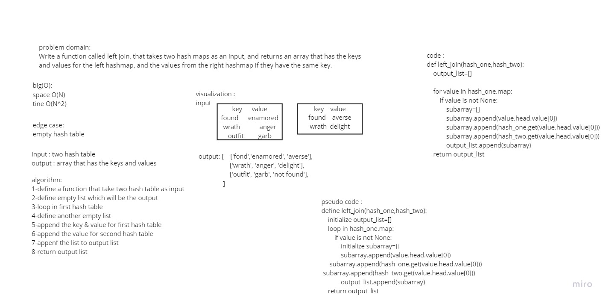

## Hashmap LEFT JOIN

The Hashmap LEFT JOIN returns an array that contains all the keys and the values from the left has table, 
with the values for the right hash tables if they have the same key.

## Whiteboard

## Challenge

Write a function called left join, that takes two hash maps as an input, and returns an array that has the keys and values for the left hashmap, and the values from the right hashmap if they have the same key.

## Approach & Efficiency

space O(N)
tine O(N^2)