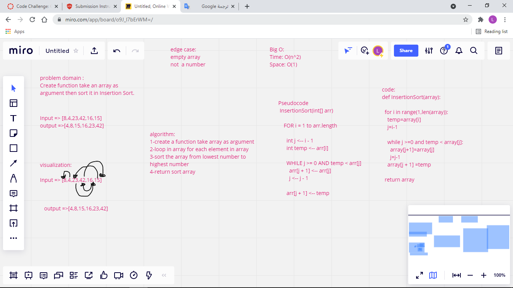

# Challenge Summary
<!-- Description of the challenge -->
Create function take an array as argument then sort it in Insertion Sort.

## Whiteboard Process
<!-- Embedded whiteboard image -->

## Approach & Efficiency
<!-- What approach did you take? Why? What is the Big O space/time for this approach? -->
Time: O(n^2)
Space: O(1)

