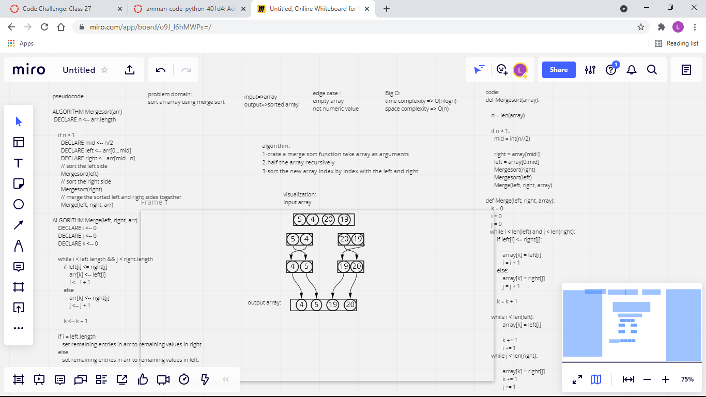

## Challenge Summary
Sort an array using merge sort, Write a code that takes an array as an input, and returns the array sorted using the merge sort method.

## Whiteboard Process

## Approach & Efficiency

time complexity => O(nlogn)
space complexity => O(n)