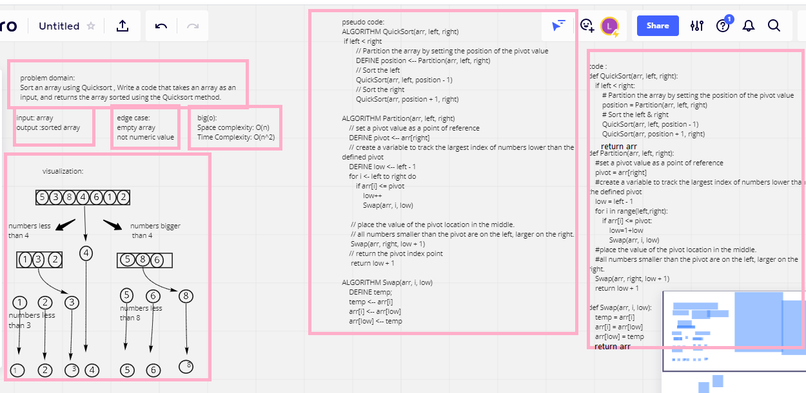

## Challenge Summary
Sort an array using Quicksort , Write a code that takes an array as an input, and returns the array sorted using the Quicksort method.

## Whiteboard Process

## Approach & Efficiency

Space complexity: O(n)
Time Complexity: O(n^2)