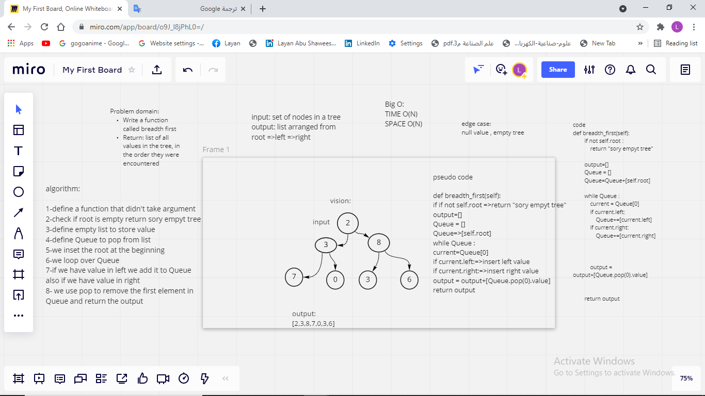

# Challenge Summary
<!-- Description of the challenge -->
To implement Breadth first traversal iterates through the tree by going through every
level of the tree node by node

## Whiteboard Process
<!-- Embedded whiteboard image -->

## Approach & Efficiency
<!-- What approach did you take? Why? What is the Big O space/time for this approach? -->
I creat two empty list, one for storing the temporary values that will  be poped and put it inside another list.
I start by save  the root value  , then loop and take the value of left element and insert it in queue list same for rigth .then we will start poping the first index until the queue is empty and return the result which contains the popped values.
